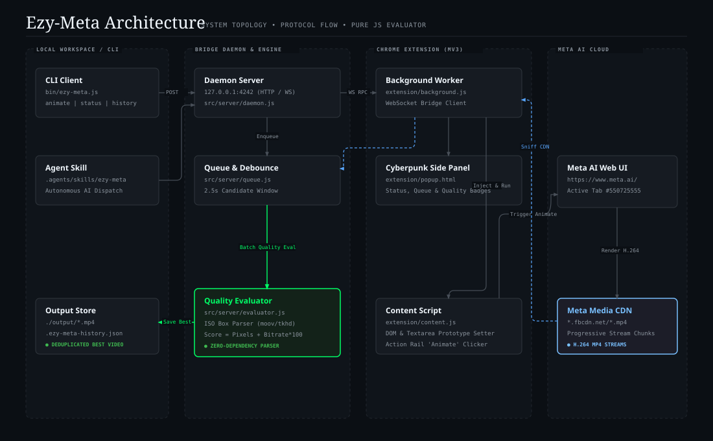

# Ezy-Meta: Meta AI Image-to-Video Bridge

[](#)
[-blue?style=flat-square)](#)
[](#architecture)
[](#video-quality-evaluation-engine)
[](#license)

**Ezy-Meta** is a high-performance developer bridge, CLI tool, and Chrome Extension (Manifest V3) that automates converting static images into cinematic animated MP4 videos using **Meta AI (`https://www.meta.ai/`)**. 

It features real-time WebSocket communication, zero-dependency browser stream sniffing via `chrome.webRequest`, React DOM synthetic event injection, an automated **2.5-second candidate debounce window**, and an in-process **Pure JavaScript MP4 ISO box parser** to evaluate resolution and bitrate—guaranteeing that **the single highest-fidelity video rendition is automatically selected and saved**.

---

## Generated Examples & Showcase

Here are real sample video animations generated end-to-end through the Ezy-Meta CLI:

| Source Image | Motion Prompt | Generated Video (10s) |
| :---: | :--- | :---: |
| <br/>*Input (16:9)* | **Giant Panda Munching Bamboo**<br/>*"A cute giant panda happily chewing and munching on fresh green bamboo stalks, gently moving paws and blinking peacefully in the bamboo forest"* | [▶ **Watch panda.mp4**](examples/panda.mp4)<br/>`1216x672` @ `4,918 kbps` |
| <br/>*Input (16:9)* | **Flying Angel Puppy**<br/>*"A joyful golden retriever puppy flapping its soft angel wings gently, flying forward through pastel clouds, happy smiling face with fluttering ears"* | [▶ **Watch dog_flying.mp4**](examples/dog_flying.mp4)<br/>`1216x672` @ `3,931 kbps` |
| <br/>*Input (1:1)* | **Calico Cat Blinking**<br/>*"A cute calico cat blinking softly, looking around with curious eyes, twitching its ears naturally in cinematic motion"* | [▶ **Watch calico_cat.mp4**](examples/calico_cat.mp4)<br/>`960x960` @ `3,343 kbps` |

> Additional assets and details are available in the [`examples/`](examples/) directory.

---

## Architecture

The following diagram adheres to the **[Diagram-Design](https://github.com/cathrynlavery/diagram-design)** editorial visual system (orthogonal routing, zero shadows, semantic tier boundaries, and focal node accentuation).



> An interactive, browser-viewable edition is available at [`docs/architecture.html`](docs/architecture.html).

---

## Detailed Architectural Breakdown

The system is organized into four decoupled architectural zones operating in tandem:

### 1. Local Workspace & Client Tier
- **CLI Client (`bin/ezy-meta.js`, `src/cli/*`)**: An intuitive command-line interface styled with a Cyberpunk neon-green theme. It submits tasks via REST, streams live terminal progress spinners, polls queue state, and prints extracted video resolution and bitrate metrics upon completion.
- **Agent Skill (`.agents/skills/ezy-meta/SKILL.md`)**: A custom agentic skill that allows AI assistants (like Google Antigravity, Claude Code, or Codex) to autonomously generate imagery and invoke video animations hands-free.
- **Output Store (`./output/`)**: Persistent directory housing final exported `.mp4` video files alongside `.ezy-meta-history.json`, maintaining deduplicated execution records with full quality metadata.

### 2. Bridge Daemon & Evaluation Engine Tier
- **WebSocket & HTTP Server (`src/server/daemon.js`)**: Runs on `127.0.0.1:4242`. Acts as the central event bus connecting local CLI calls with the Chrome Extension.
- **Task Queue & Window Debouncer (`src/server/queue.js`)**: Manages concurrency, job status transitions (`PENDING` $\rightarrow$ `PROCESSING` $\rightarrow$ `COMPLETED`), and coordinates the candidate aggregation window.
- **Pure JS Quality Evaluator (`src/server/evaluator.js`)**: 
  - **Zero-Dependency ISO Parser**: Reads MP4 header boxes (`moov` $\rightarrow$ `mvhd` and `tkhd`) to extract native dimensions (`width`, `height`), timescale, and exact duration without needing `ffmpeg` or `ffprobe`.
  - **Bitrate Computation**: Calculates effective bitrate ($\text{kbps} = \frac{\text{fileSizeBytes} \times 8}{\text{durationSec} \times 1000}$).
  - **Deduplication Engine**: Evaluates MD5 checksums across range requests and CDN chunks to eliminate redundant downloads.

### 3. Chrome Extension Tier (Manifest V3)
- **Background Service Worker (`extension/background.js`)**:
  - Maintains a persistent WebSocket link to the local daemon.
  - Automatically identifies, pings, and verifies active `https://www.meta.ai/` browser tabs.
  - Intercepts completed media requests matching `*.fbcdn.net/*.mp4` and `video-*.xx.fbcdn.net` via `chrome.webRequest.onCompleted`.
  - Maintains an in-memory `capturedTaskUrls` registry per task to suppress duplicate chunk triggers.
- **Cyberpunk Side Panel UI (`extension/popup.html`, `popup.js`)**:
  - Embedded directly into Chrome's native Side Panel (`chrome.sidePanel`).
  - Displays real-time connection badges (Daemon Port 4242 status, Meta AI Tab readiness, and logged-in user profile).
  - Displays active animation progress, pending task queue, and history cards with neon resolution and bitrate tags.
- **Content Script (`extension/content.js`)**:
  - Injected directly into `https://www.meta.ai/*`.
  - Automates file input attachment via synthetic `DataTransfer` objects.
  - Injects prompts into Meta AI's React `<textarea>` by invoking `HTMLTextAreaElement.prototype` property descriptors to ensure React internal state updates.
  - Detects and triggers the native `Animate` button within Meta AI's media action rail.

### 4. Meta AI Cloud Tier
- **Meta AI Web Interface**: Meta's conversational generative AI frontend.
- **Meta Media CDN**: High-throughput CDN endpoints (`scontent.xx.fbcdn.net`) streaming progressive H.264 video chunks.

---

## End-to-End Execution Lifecycle

```
[CLI / Agent]                 [Daemon Server]               [Chrome Extension]             [Meta AI Tab]
      |                              |                              |                            |
      |-- 1. POST /api/animate ----->|                              |                            |
      |   (Image Base64 + Prompt)    |-- 2. WS: TASK_ASSIGN ------->|                            |
      |                              |                              |-- 3. Injects File Payload ->|
      |                              |                              |-- 4. Injects Prompt & Send->|
      |                              |                              |<-- 5. Waits for Render ----|
      |                              |                              |-- 6. Clicks 'Animate' ---->|
      |                              |                              |<-- 7. Streams H.264 MP4 ---|
      |                              |<-- 8. WS: VIDEO_CANDIDATE ---|    (Captured via webRequest)
      |                              |   (Opens 2.5s Debounce Win)  |                            |
      |                              |<-- 9. Collects Candidates ---|                            |
      |                              |                              |                            |
      |                              |-- 10. Pure JS MP4 Parsing ---|                            |
      |                              |   (moov/tkhd: 1216x672)      |                            |
      |                              |-- 11. Quality Scoring -------|                            |
      |                              |-- 12. Save Winner to Disk ---|                            |
      |<-- 13. Task Completed -------|-- 14. WS: TASK_FINALIZED --->| (Updates Side Panel UI)
      |   (Resolution & Bitrate)     |                              |
```

1. **Submission**: User or AI invokes `node bin/ezy-meta.js animate <image> --prompt "<prompt>"`.
2. **Dispatch**: Daemon enqueues the task and sends a `TASK_ASSIGN` message over WebSocket to the Chrome background worker.
3. **DOM Attachment**: Content script constructs a synthetic `File` and dispatches change/input events to Meta AI's hidden `<input type="file">`.
4. **Prompt Injection**: Text is injected into Meta AI's `<textarea data-testid="composer-input">` using prototype value setters followed by synthetic input events so React activates the Send button.
5. **Animation Trigger**: Content script watches for Meta AI's response card and triggers the native `Animate` icon button.
6. **Stream Interception**: Chrome's network stack sniffs the incoming `video-*.xx.fbcdn.net/*.mp4` stream via `chrome.webRequest.onCompleted`.
7. **Quality Evaluation Window**: The daemon opens a 2.5-second debounce window to collect all emitted video chunks. It downloads the candidates to a temporary scratch path, parses ISO Base Media boxes, evaluates the quality score, promotes the single best video to `./output/`, and purges duplicates.
8. **Reporting**: The CLI receives the completion payload, logs the file path, and prints the resolution, bitrate, duration, and score.

---

## Video Quality Evaluation Engine

Meta AI's web player routinely initiates multiple HTTP Range requests (fetching `moov` atom headers, initial playback buffers, and final progressive chunks). Without proper evaluation, duplicate identical files are created. Furthermore, when multiple renditions are available, the system must deterministically pick the highest fidelity stream.

### Scoring Algorithm

The evaluator calculates a composite score for each candidate stream:

$$\text{Quality Score} = (\text{Width} \times \text{Height}) \times 1.0 + (\text{Bitrate}_{\text{kbps}} \times 100) + (\text{Valid Duration} > 0 \ ?\ 50000 : 0)$$

1. **Resolution Priority**: Total pixel count is the primary sorting factor ($1216 \times 672 = 817{,}152$ pixels vs $960 \times 960 = 921{,}600$ pixels).
2. **Bitrate Priority**: For streams with identical resolutions, the candidate with the highest bitrate is selected to minimize compression artifacts and preserve motion detail.
3. **Deduplication**: Files with matching MD5 hashes are flagged as redundant range chunks and discarded automatically.

---

## Installation & Setup

### Prerequisites
- **Node.js**: v18.0.0 or higher
- **Google Chrome**: Latest version with access to [https://www.meta.ai/](https://www.meta.ai/)

### 1. Install Dependencies
```bash
git clone https://github.com/gcoderbh/ezy-meta.git
cd ezy-meta
npm install
```

### 2. Load the Chrome Extension
1. Open Google Chrome and navigate to `chrome://extensions/`.
2. Toggle **Developer mode** in the top right corner.
3. Click **Load unpacked** and select the `extension/` folder inside this repository.
4. Click the Extension icon in Chrome's toolbar and select **Open side panel** (or click the pinned Ezy-Meta icon).

### 3. Log In to Meta AI
1. In the same Chrome browser, open [https://www.meta.ai/](https://www.meta.ai/).
2. Log in with your Meta / Facebook account.
3. The Ezy-Meta Side Panel will immediately transition its status badge to **`ONLINE`** with `Meta AI Tab: Ready`.

---

## CLI Usage

### Check System Status
Verifies daemon connectivity, Chrome extension state, and Meta AI tab readiness:
```bash
node bin/ezy-meta.js status
```

### Animate an Image
Converts any local JPG or PNG image into an animated MP4 video:
```bash
node bin/ezy-meta.js animate ./dog.jpg \
  --prompt "Turn this photo into a video: A happy puppy flapping wings in slow motion through clouds" \
  --output ./output/dog_flying.mp4
```

To start a fresh conversation context before generating (clearing previous chat DOM state):
```bash
node bin/ezy-meta.js animate ./dog.jpg --prompt "..." --fresh
```

### Session Management & Auto-Recovery
Meta AI's single-page application accumulates heavy DOM elements and video players over time. Ezy-Meta includes built-in session resilience:

- **Auto-Refresh**: Automatically reloads the Meta AI tab after every 5 consecutive generations to prevent memory leakage and playback stalls.
- **Error Sniffing**: Automatically detects Meta AI error banners (rate-limits, temporary generation failures) and flags the session.
- **Reload Tab**: Force a clean reload of the active Meta AI browser window:
  ```bash
  node bin/ezy-meta.js session reload
  ```
- **New Conversation**: Navigate to a brand-new clean chat session (`https://www.meta.ai/`):
  ```bash
  node bin/ezy-meta.js session new
  ```
- **Side Panel Controls**: Quick-action buttons (`🔄 RELOAD TAB` and `➕ NEW CHAT`) are also accessible directly inside Chrome's Side Panel.

### View Generation History
Displays all previous generations, file locations, and quality metrics:
```bash
node bin/ezy-meta.js history
```
Output:
```text
GENERATION HISTORY (2):

[1] COMPLETED | task_1788508679570_6cab6 | 2026-09-04T07:57:59.570Z
    Prompt : "Turn this photo into a video: A joyful golden retriever puppy flapping its soft angel wings..."
    Quality: 1216x672 @ 3931 kbps (10s, 4.69 MB, Score: 1260252)
    File   : /Users/.../ezy-meta/output/video_1788508742346_6cab6.mp4

[2] COMPLETED | task_1788508293868_ate54 | 2026-09-04T07:51:33.868Z
    Prompt : "Turn this photo into a video: A cute calico cat blinking softly, looking around with curious eyes..."
    Quality: 960x960 @ 3343 kbps (10s, 3.99 MB, Score: 1305900)
    File   : /Users/.../ezy-meta/output/video_1788508352130_ate54.mp4
```

### Run Daemon in Foreground
```bash
node bin/ezy-meta.js serve --port 4242
```

---

## Agent Skill Integration

Ezy-Meta includes a ready-to-use Agent Skill located at [`.agents/skills/ezy-meta/SKILL.md`](.agents/skills/ezy-meta/SKILL.md). 

AI agents (such as Google Antigravity, Claude Code, or Codex) automatically discover and use this skill when asked to:
- Convert generated images to videos
- Animate scenes or storyboard frames
- Generate cinematic motions via Meta AI

---

## Project Structure

```text
ezy-meta/
├── .agents/
│   └── skills/
│       └── ezy-meta/
│           └── SKILL.md             # AI Agent discovery & invocation skill
├── bin/
│   └── ezy-meta.js                  # CLI Entry point executable
├── docs/
│   ├── architecture.svg             # Standalone Editorial SVG diagram
│   └── architecture.html            # Standalone diagram viewer
├── extension/
│   ├── manifest.json                # Manifest V3 configuration (sidePanel, webRequest)
│   ├── background.js                # Service Worker, WS bridge, webRequest sniffer
│   ├── content.js                   # DOM automation, React prototype injection
│   ├── popup.html                   # Cyberpunk Side Panel UI
│   ├── popup.js                     # Side Panel real-time reactive logic
│   └── popup.css                    # Dark cyberpunk design styling
├── output/
│   ├── .ezy-meta-history.json       # Deduplicated generation records & metadata
│   └── *.mp4                        # Downloaded high-resolution MP4 videos
├── src/
│   ├── cli/
│   │   ├── commands.js              # CLI command execution handlers
│   │   └── logger.js                # Terminal banner, ASCII art, and colored logging
│   └── server/
│       ├── daemon.js                # HTTP & WebSocket bridge server (port 4242)
│       ├── downloader.js            # Video stream downloader
│       ├── evaluator.js             # Pure JS MP4 box parser & quality scoring
│       └── queue.js                 # Task lifecycle & history manager
├── package.json
└── README.md
```

---

## License

MIT License. Designed and maintained for modern AI automation workflows.
